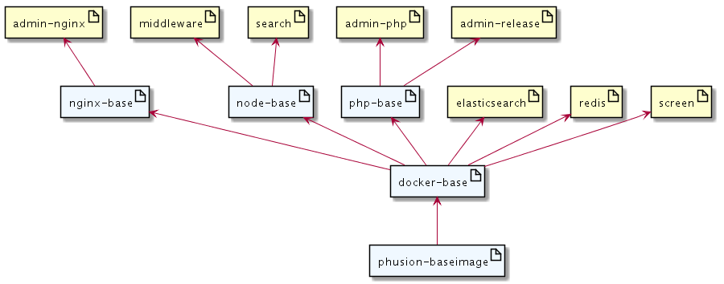

# OS2Display - docker images
These images are used for production as well as development usage.
Base-images are introduced where serveral images requires the same functionallity.

## Image hierachy
The following diagram depicts how the images are related during build.

### phusion-baseimage
Phusion Baseimage that acts as the ultimate base for all of our images. The image is based on ubuntu 18.04. See https://github.com/phusion/baseimage-docker for details.

### docker-base
Base image based on phusion. This image makes out the "os" part of our images, 
ie. this is where an update to OS-level things should land.

Any downstream image based on this image should focus on their particular need
and finish off by clearing the apt-cache.

### php-base
Basic php-functionality, note that we only install php-cli at this point.

### nginx-base
Base-image for all nginx images.

### node-base
Basic nodejs-functionality.

### admin-nginx
The static parts of the admin-backend, also acts as frontend for the php-fpm
container.

### admin-php
PHP-FPM image ready for hosting the dynamic part of the admin backend.

### admin-release
Contains a source-release of the OS2Display administration, this is what you 
normally build prior to doing a prod-release.

### search
NodeJS app that warps elasticsearch.

### elasticsearch
Elasticsearch server.

### middleware
Nodejs app that wraps redis and handles websocket connections between screen and admin

### redis
Redis server.
